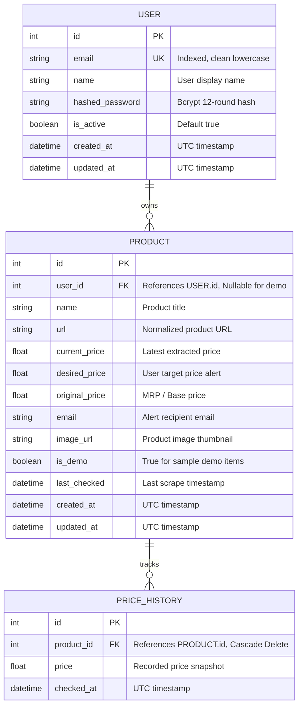

# SmartPrice Tracker — Comprehensive Project & Technical Architecture Report

**Project Name:** SmartPrice Tracker  
**Repository:** [saicharan0925/Pricetracker-2](https://github.com/saicharan0925/Pricetracker-2)  
**Version:** 2.0.0 (Production Release)  
**Live Frontend:** [pricetracker-2.vercel.app](https://pricetracker-2.vercel.app)  
**Live Backend:** [smartprice-backend on Render](https://dashboard.render.com)  

---

## Table of Contents
1. [Executive Summary & Project Overview](#1-executive-summary--project-overview)
2. [High-Level System Architecture](#2-high-level-system-architecture)
3. [Technology Stack](#3-technology-stack)
4. [File-by-File Architectural Breakdown](#4-file-by-file-architectural-breakdown)
   - [Root Configuration Files](#root-configuration-files)
   - [Backend Service (`/backend`)](#backend-service-backend)
   - [Frontend Application (`/frontend`)](#frontend-application-frontend)
5. [Core Features & Technical Implementation](#5-core-features--technical-implementation)
   - [A. User Authentication & Session Security](#a-user-authentication--session-security)
   - [B. Multi-Tenant Privacy & Data Isolation](#b-multi-tenant-privacy--data-isolation)
   - [C. Intelligent Multi-Platform Web Scraping Engine](#c-intelligent-multi-platform-web-scraping-engine)
   - [D. Automated Background Price Tracking Scheduler](#d-automated-background-price-tracking-scheduler)
   - [E. Deal Detection & Alert Decision Engine](#e-deal-detection--alert-decision-engine)
   - [F. Multi-Channel Email Notification Engine](#f-multi-channel-email-notification-engine)
   - [G. Interactive Price Analytics & History Visualization](#g-interactive-price-analytics--history-visualization)
   - [H. Search, Multi-Filter, Sorting & CSV Export](#h-search-multi-filter-sorting--csv-export)
6. [Database Schema & Entity Relationship Diagram](#6-database-schema--entity-relationship-diagram)
7. [Comprehensive REST API Specification](#7-comprehensive-rest-api-specification)
8. [DevOps, Deployment & Cloud Infrastructure](#8-devops-deployment--cloud-infrastructure)
9. [Edge Cases, Troubleshooting & Key Architectural Solutions](#9-edge-cases-troubleshooting--key-architectural-solutions)

---

## 1. Executive Summary & Project Overview

**SmartPrice Tracker** is a full-stack, enterprise-grade e-commerce price monitoring and deal intelligence platform. It tracks product prices across top retailers including **Amazon**, **Flipkart**, and **Myntra**, providing automated background price scraping, historical price volatility analytics, and instant multi-channel alert notifications (via Brevo HTTP API, Resend REST API, and Gmail SMTP) whenever prices drop below user-defined target thresholds.

### Key Objectives Achieved:
- **Zero-Friction Tracking:** Users simply paste a product URL from Amazon, Flipkart, or Myntra; the engine automatically extracts product titles, high-resolution imagery, and current prices.
- **Strict Data Privacy & Isolation:** Public visitors experience a curated "Demo Showcase" with zero risk of user data exposure. Authenticated users operate in a private, encrypted vault where tracked items, URLs, and emails are visible solely to the owner.
- **Cloud-Resilient Scraping:** Handles anti-bot challenges and single-page application (SPA) client-side rendering via specialized mobile emulation and Schema.org JSON-LD structured data parsing.
- **Fail-Safe Cloud Delivery:** Solves the notorious Render Free Tier SMTP port blocking (ports 25, 465, 587) by supporting modern HTTPS REST email APIs (Brevo & Resend) that communicate over port 443 with zero recipient restrictions.

---

## 2. High-Level System Architecture

```mermaid
graph TD
    UserClient[Web Browser / Mobile Client] -->|HTTPS Requests| VercelEdge[Vercel CDN Edge / SPA Host]
    VercelEdge -->|Serves React Bundle| UserClient
    UserClient -->|REST API / Bearer JWT| RenderBackend[Render Cloud Web Service - FastAPI]
    
    subgraph "Render Cloud Backend (FastAPI)"
        MainApp[app.main:app]
        AuthRouter[/api/auth Router]
        ProductsRouter[/api/products Router]
        PriceService[Price Service Engine]
        ScraperEngine[Scraper Engine - Requests / BS4]
        EmailService[Email Service Router]
        APSched[APScheduler Background Worker]
        
        MainApp --> AuthRouter
        MainApp --> ProductsRouter
        ProductsRouter --> PriceService
        ProductsRouter --> EmailService
        PriceService --> ScraperEngine
        PriceService --> EmailService
        APSched -->|Recurring Cron| PriceService
    end
    
    subgraph "Database Layer"
        SQLiteDB[(SQLite Database - smartprice.db)]
        AuthRouter -->|User Auth| SQLiteDB
        ProductsRouter -->|CRUD Products| SQLiteDB
        PriceService -->|Price History Snapshots| SQLiteDB
    end

    subgraph "Target E-Commerce Retailers"
        ScraperEngine -->|Mobile Header Emulation| Flipkart[Flipkart.com JSON-LD]
        ScraperEngine -->|Desktop User-Agent| Amazon[Amazon.in Product Page]
        ScraperEngine -->|DOM Parsing| Myntra[Myntra.com]
    end

    subgraph "Email Delivery Providers"
        EmailService -->|HTTPS Port 443| BrevoAPI[Brevo REST API - Any Recipient]
        EmailService -->|HTTPS Port 443| ResendAPI[Resend REST API - Owner Sandbox]
        EmailService -.->|Blocked on Render Free| GmailSMTP[Gmail SMTP :587]
    end
```

---

## 3. Technology Stack

### Frontend Architecture
| Layer | Technology | Purpose |
|---|---|---|
| **Framework** | React 18.2 | Component-driven user interface |
| **Bundler & Tooling** | Vite 5.4 | Lightning-fast HMR and optimized production bundles |
| **Styling & Design** | Tailwind CSS 3.4 | Modern dark-mode glassmorphic design system |
| **Icons** | Lucide React | Clean, scalable feather-style UI iconography |
| **Data Visualization** | Recharts 2.12 | Responsive SVG price trend and historical line charts |
| **Routing** | React Router DOM 6.22 | Client-side SPA routing with protected route guards |
| **HTTP Client** | Axios 1.6 | Configured with automatic URL normalization & auth interceptors |
| **Notifications** | React Hot Toast | Polished asynchronous toast alerts |

### Backend Architecture
| Layer | Technology | Purpose |
|---|---|---|
| **API Framework** | FastAPI 0.115 | High-performance asynchronous REST API framework |
| **ASGI Server** | Uvicorn 0.30 | Lightning-fast ASGI production web server |
| **ORM & Database** | SQLAlchemy 2.0 + SQLite | Relational persistence with foreign-key integrity |
| **Data Validation** | Pydantic v2 + Pydantic-Settings | Strict request/response validation & env typing |
| **Task Scheduling** | APScheduler 3.10 | In-process background cron scheduler for price checking |
| **Web Scraping** | Requests + BeautifulSoup4 + LXML | Resilient multi-selector & Schema.org JSON-LD parsing |
| **Security & Auth** | Passlib (Bcrypt) + PyJWT | Industry-standard password hashing and JWT issuance |
| **Rate Limiting** | SlowAPI 0.1.9 | Memory-based sliding-window IP rate limiting |
| **Email HTTP Clients** | HTTPX + smtplib | Dual-mode support for HTTPS REST APIs & traditional SMTP |

---

## 4. File-by-File Architectural Breakdown

### Root Configuration Files

#### [`render.yaml`](file:///e:/MY-PROJECTS/Pricetracker-2/render.yaml)
- **Role:** Infrastructure-as-Code blueprint for deploying the FastAPI backend to Render.
- **Key Settings:** Defines a `web` service in Python 3.11.9, region `oregon`, build command `pip install -r requirements.txt`, start command `uvicorn app.main:app --host 0.0.0.0 --port $PORT`, and health check path `/api/health`.
- **Environment Variables:** Declares configurations for JWT secrets, database persistence, and placeholders for email credentials.

#### [`.gitignore`](file:///e:/MY-PROJECTS/Pricetracker-2/.gitignore)
- **Role:** Prevents leakage of credentials, build artifacts, and databases.
- **Key Inclusions:** Ignores `.env`, `*.db`, `node_modules/`, `dist/`, `__pycache__/`, `.pytest_cache/`.

#### [`DEPLOYMENT.md`](file:///e:/MY-PROJECTS/Pricetracker-2/DEPLOYMENT.md) & [`README.md`](file:///e:/MY-PROJECTS/Pricetracker-2/README.md)
- **Role:** Developer guides, system setup instructions, API overviews, and production checklist.

---

### Backend Service (`/backend`)

#### [`backend/app/main.py`](file:///e:/MY-PROJECTS/Pricetracker-2/backend/app/main.py)
- **Role:** Main application entry point and lifecycle coordinator.
- **Key Functions:**
  - `lifespan(app)`: Initializes database tables (`Base.metadata.create_all`), seeds default demo items, starts the APScheduler, and cleanly shuts down on exit.
  - **CORS Middleware:** Configured with `allow_origin_regex=r"^https://.*(\.vercel\.app|\.onrender\.com)$"` to seamlessly allow dynamic preview and production URLs on Vercel and Render while supporting `allow_credentials=True`.
  - **Dual Route Mounting:** Includes `auth_router` and `products_router` both at `/api` and at root (`/`) to provide zero-config resilience against client URL variations.
  - **Health Checks:** Exposes `/`, `/health`, and `/api/health`.

#### [`backend/app/config.py`](file:///e:/MY-PROJECTS/Pricetracker-2/backend/app/config.py)
- **Role:** Type-safe settings management using `pydantic-settings`.
- **Key Configurations:** `DATABASE_URL`, `JWT_SECRET`, `ACCESS_TOKEN_EXPIRE_DAYS`, `CHECK_INTERVAL_MINUTES`, `FRONTEND_URL`, and multi-channel email keys (`BREVO_API_KEY`, `RESEND_API_KEY`, `SMTP_*`).

#### [`backend/app/database/database.py`](file:///e:/MY-PROJECTS/Pricetracker-2/backend/app/database/database.py)
- **Role:** SQLAlchemy engine and session factory.
- **Key Implementation:** Connects to `smartprice.db` with SQLite WAL (Write-Ahead Logging) pragmas (`PRAGMA foreign_keys=ON`, `PRAGMA journal_mode=WAL`) for high-concurrency read/write performance. Exposes `get_db()` dependency for FastAPI route injections.

#### [`backend/app/models/models.py`](file:///e:/MY-PROJECTS/Pricetracker-2/backend/app/models/models.py)
- **Role:** Declarative ORM models representing the core database schema.
  - `User`: Accounts with `email` (unique index), `hashed_password`, `name`, `is_active`, `created_at`.
  - `Product`: Tracked products with `user_id` (foreign key to `users.id`, nullable for demo products), `name`, `url`, `current_price`, `desired_price`, `original_price`, `email`, `image_url`, `is_demo`, `last_checked`.
  - `PriceHistory`: Immutable historical pricing records with `product_id` (foreign key to `products.id`), `price`, and `checked_at`.

#### [`backend/app/schemas/schemas.py`](file:///e:/MY-PROJECTS/Pricetracker-2/backend/app/schemas/schemas.py)
- **Role:** Pydantic validation schemas defining incoming payloads and outgoing JSON structures.
- **Key Schemas:** `UserCreate`, `UserLogin`, `UserResponse`, `TokenResponse`, `ProductCreate`, `ProductUpdate`, `ProductResponse`, `PriceHistoryResponse`, `StatsResponse`, `CheckPriceResponse`.

#### [`backend/app/api/auth.py`](file:///e:/MY-PROJECTS/Pricetracker-2/backend/app/api/auth.py)
- **Role:** Authentication endpoints.
- **Endpoints:**
  - `POST /auth/register`: Creates new user account, hashes password via bcrypt, issues JWT token.
  - `POST /auth/login`: Authenticates credentials and returns JWT bearer token.
  - `GET /auth/me`: Validates token and returns current user profile.

#### [`backend/app/api/products.py`](file:///e:/MY-PROJECTS/Pricetracker-2/backend/app/api/products.py)
- **Role:** Primary REST controller for all product operations.
- **Key Logic:**
  - `get_products()`: Dual-mode query. Public/guest visitors receive only curated demo items with emails masked (`null`). Authenticated users receive their own privately tracked items plus demo items.
  - `create_product()`: Requires authenticated user. Runs immediate initial scrape; sends welcome tracking confirmation email.
  - `update_product()` / `delete_product()`: Owner-protected mutation endpoints.
  - `check_product_price()`: Triggers real-time re-scrape, records price history snapshot, and sends deal email if target met.
  - `export_csv()`: Generates and streams downloadable CSV report.

#### [`backend/app/services/scraper.py`](file:///e:/MY-PROJECTS/Pricetracker-2/backend/app/services/scraper.py)
- **Role:** Scrapes product metadata from target e-commerce stores.
- **Architecture Highlights:**
  - `get_headers(url)`: Emulates mobile browser headers (`iPhone Safari`) specifically for Flipkart, unlocking complete server-rendered Schema.org JSON-LD data.
  - `scrape_amazon()`: Multi-selector CSS parser targeting `#productTitle`, `.a-price .a-offscreen`, `span.basisPrice`, and high-res image carousels.
  - `scrape_flipkart()`: Schema.org JSON-LD parser as primary, fallback to `div.Nx9bqj` and `div._30jeq3`.
  - `scrape_myntra()`: Targets `.pdp-title`, `.pdp-price`, and `.pdp-mrp`.
  - `scrape_generic()`: Universal fallback extracting Open Graph tags and Schema.org scripts from any web store.
  - Anti-Bot Bypass: Accurately distinguishes between real challenge pages (`<title>Robot Check</title>`) and inline scripts containing `"isReCaptchaEnabled"`.

#### [`backend/app/services/price_service.py`](file:///e:/MY-PROJECTS/Pricetracker-2/backend/app/services/price_service.py)
- **Role:** Business logic coordinator for price comparison and historical record tracking.
- **Key Logic:** Executes scraper, logs new `PriceHistory` point, calculates whether current price meets or drops below `desired_price`, and delegates alert dispatch to `email_service`.

#### [`backend/app/services/email_service.py`](file:///e:/MY-PROJECTS/Pricetracker-2/backend/app/services/email_service.py)
- **Role:** Multi-provider email notification engine.
- **Providers Supported:**
  1. **Brevo HTTP API (`https://api.brevo.com/v3/smtp/email`):** Sends to any recipient over HTTPS port 443 with no domain restriction. Ideal for cloud deployments on free tiers.
  2. **Resend REST API (`https://api.resend.com/emails`):** Modern developer email API. Free sandbox tier sends to verified owner; custom domain enables global delivery.
  3. **Gmail SMTP (`smtp.gmail.com:587`):** Standard TLS smtplib delivery using 16-character App Passwords.
- **Templates:** Includes high-converting HTML templates for `send_verification_email` (welcome to tracking), `send_price_drop_email` (deal alert with action button), and `send_test_email` (system diagnostics).

#### [`backend/app/scheduler/scheduler.py`](file:///e:/MY-PROJECTS/Pricetracker-2/backend/app/scheduler/scheduler.py)
- **Role:** Background task runner powered by `APScheduler.BackgroundScheduler`.
- **Execution:** Runs every 30 minutes (configurable via `CHECK_INTERVAL_MINUTES`), iterating through all non-demo products, executing fresh price scrapes, and triggering deal emails automatically.

#### [`backend/app/utils/security.py`](file:///e:/MY-PROJECTS/Pricetracker-2/backend/app/utils/security.py)
- **Role:** Cryptographic utilities. Handles bcrypt password hashing, verification, JWT encoding (`HS256`), and FastAPI dependencies: `get_current_user` (strict guard) and `get_optional_user` (soft guard for public/private dual views).

#### [`backend/app/utils/validators.py`](file:///e:/MY-PROJECTS/Pricetracker-2/backend/app/utils/validators.py)
- **Role:** Sanitizes URLs, cleans tracking affiliate query parameters, and validates emails.

#### [`backend/app/utils/limiter.py`](file:///e:/MY-PROJECTS/Pricetracker-2/backend/app/utils/limiter.py) & [`logger.py`](file:///e:/MY-PROJECTS/Pricetracker-2/backend/app/utils/logger.py)
- **Role:** Standardized logging output and SlowAPI rate limiting definitions.

---

### Frontend Application (`/frontend`)

#### [`frontend/src/main.jsx`](file:///e:/MY-PROJECTS/Pricetracker-2/frontend/src/main.jsx) & [`frontend/src/App.jsx`](file:///e:/MY-PROJECTS/Pricetracker-2/frontend/src/App.jsx)
- **Role:** Client entry point and router definition.
- **Context Providers:** Wraps application in `AuthProvider` (auth state), `ThemeProvider` (theme toggles), and `Toaster` (notifications).
- **Route Catalog:**
  - `/`: Modern landing page with interactive demonstration and hero section.
  - `/dashboard`: Main tracking dashboard with statistics, search, filters, and product grid.
  - `/products/:id`: Deep-dive product analytics, live price check, and interactive Recharts price trend graph.
  - `/add`: Authenticated product creation form with live URL validation.
  - `/analytics`: Global price drop trends and platform monitoring statistics.
  - `/features`: Feature breakdown and how-it-works overview.
  - `/login`: User sign-in with redirect preservation.
  - `/register`: User account creation.
  - `*`: 404 Not Found page.

#### [`frontend/src/services/api.js`](file:///e:/MY-PROJECTS/Pricetracker-2/frontend/src/services/api.js)
- **Role:** Centralized Axios API service layer.
- **Key Features:**
  - **Dynamic Base URL Normalizer:** `resolveBaseURL()` automatically handles trailing slashes, adds missing `/api` prefixes, and defaults to `http://localhost:8000/api` if unset.
  - **Auth Request Interceptor:** Automatically injects `Authorization: Bearer <smartprice_token>` into every request.
  - **Response Normalizers:** Normalizes backend `snake_case` properties to frontend `camelCase` while preserving both for component compatibility.

#### [`frontend/src/context/AuthContext.jsx`](file:///e:/MY-PROJECTS/Pricetracker-2/frontend/src/context/AuthContext.jsx)
- **Role:** Global authentication state provider.
- **Functions:** `login(email, password)`, `register(email, password, name)`, `logout()`. Stores token in `localStorage('smartprice_token')` and re-verifies session via `/auth/me` on initial load.

#### [`frontend/src/components/ProductCard.jsx`](file:///e:/MY-PROJECTS/Pricetracker-2/frontend/src/components/ProductCard.jsx)
- **Role:** Card representation of a tracked product.
- **Features:** High-resolution product image with fallback placeholder, store badge (Amazon/Flipkart/Myntra), "Price Pending" badge for unextracted items, "DEAL HIT" badge when target met, percentage discount pill, quick "Check Now" button with spinner, and quick edit/delete controls.

#### [`frontend/src/components/PriceChart.jsx`](file:///e:/MY-PROJECTS/Pricetracker-2/frontend/src/components/PriceChart.jsx)
- **Role:** Interactive SVG price history chart powered by `Recharts`.
- **Features:** Responsive container, area gradient fill, interactive tooltips formatted in Indian Rupees (INR), desired target price reference line, and responsive date formatting.

#### [`frontend/src/components/EmailConfigModal.jsx`](file:///e:/MY-PROJECTS/Pricetracker-2/frontend/src/components/EmailConfigModal.jsx)
- **Role:** Diagnostic and configuration modal for email delivery.
- **Features:** Displays live active email provider status, guidance tabs for Brevo, Resend, and Gmail SMTP, and an interactive "Send Test Email" tool to verify delivery directly from the browser.

#### [`frontend/src/components/EditProductModal.jsx`](file:///e:/MY-PROJECTS/Pricetracker-2/frontend/src/components/EditProductModal.jsx)
- **Role:** Modal to update product name, target desired price, current price, and recipient notification email.

#### [`frontend/src/components/StatsCards.jsx`](file:///e:/MY-PROJECTS/Pricetracker-2/frontend/src/components/StatsCards.jsx) & [`frontend/src/components/SearchFilter.jsx`](file:///e:/MY-PROJECTS/Pricetracker-2/frontend/src/components/SearchFilter.jsx)
- **Role:** Dashboard summary metrics (Total Tracked, Average Price, Lowest Price, Recent Drops) and real-time search, sorting (Newest, Price Low-High, Price High-Low, Biggest Drop), and store filters (Amazon, Flipkart, Myntra).

#### [`frontend/vercel.json`](file:///e:/MY-PROJECTS/Pricetracker-2/frontend/vercel.json)
- **Role:** Vercel deployment specification ensuring client-side SPA routing (`/(.*) -> /index.html`) so subpages never return 404 upon browser refresh.

---

## 5. Core Features & Technical Implementation

### A. User Authentication & Session Security
- **Registration & Login:** Passwords are encrypted using `bcrypt` (12 rounds) via `passlib.context.CryptContext`.
- **Tokens:** Issues signed JSON Web Tokens (`HS256`) with a 7-day expiration containing `sub: user.id` and `email`.
- **Client Handling:** Axios request interceptor attaches the bearer token; `AuthContext` provides stateful `user` object to all views.
- **Protected Actions:** Modifying, deleting, or adding private items requires valid credentials.

### B. Multi-Tenant Privacy & Data Isolation
- **Public Demo Mode:** Unauthenticated visitors browsing `/dashboard` see only official demonstration items (e.g. iPhone 15, MacBook Air M2, Kindle Paperwhite, Sony WH-1000XM5). All recipient email addresses are strictly sanitized to `null` before transmission.
- **Private User Vault:** Authenticated users see their own tracked items alongside demo items. Private items added by one user are completely hidden from other users at the database query level (`db.query(Product).filter((Product.user_id == current_user.id) | (Product.is_demo == True))`).

### C. Intelligent Multi-Platform Web Scraping Engine
- **Flipkart Mobile JSON-LD Emulation:** Flipkart renders an empty SPA shell to standard desktop bot requests. By emulating modern mobile User-Agents (`iPhone Safari`), Flipkart returns complete server-rendered Schema.org JSON-LD scripts containing exact price integers and high-res image assets.
- **Amazon Multi-Layer Fallback:** Targets `#corePriceDisplay_desktop_feature_div`, `.a-price .a-offscreen`, and fallback selectors.
- **Anti-Bot Filtering:** Accurately ignores internal React configuration flags like `"isReCaptchaEnabled": true` to prevent false positive scrape cancellations.

### D. Automated Background Price Tracking Scheduler
- Powered by `APScheduler` running in the FastAPI application process.
- Runs on a recurring 30-minute schedule (`CHECK_INTERVAL_MINUTES=30`).
- Iterates through non-demo products, executes scrapers, records new price snapshots into `PriceHistory`, and triggers deal alerts if target criteria are met.

### E. Deal Detection & Alert Decision Engine
- **Deal Hit Criteria:** A deal is triggered when:
  $$\text{Current Price} \le \text{Desired Price}$$
  OR when price drops by $\ge 10\%$ in a single check interval.
- **UI Feedback:** Displays glowing `DEAL HIT` badges and percentage-off pills.
- **Email Trigger:** Instantly dispatches a formatted deal notification with direct links to the retailer store.

### F. Multi-Channel Email Notification Engine
- **Triple-Provider Router:**
  ```python
  # Priority 1: Brevo HTTP API (Port 443 — works globally on Render Free tier)
  if is_brevo_configured(): return _send_via_brevo(...)
  # Priority 2: Resend REST API (Port 443 — works for account owner)
  if is_resend_configured(): return _send_via_resend(...)
  # Priority 3: Standard SMTP (Gmail / Brevo SMTP :587)
  if is_smtp_configured(): return _send_via_smtp(...)
  ```
- **Templates:** Responsive, dark-themed HTML emails with product imagery, current vs original price comparisons, and CTA buttons.

### G. Interactive Price Analytics & History Visualization
- Every price check creates an immutable `PriceHistory` record timestamped in UTC.
- Renders responsive SVG charts with min/max bounds, formatted date axes, and gradient fills.

### H. Search, Multi-Filter, Sorting & CSV Export
- Search across product titles in real time.
- Filter by store: All, Amazon, Flipkart, Myntra.
- Sort by Newest, Price (Ascending/Descending), and Biggest Drop.
- One-click CSV export: Streams a `.csv` report of all tracked products.

---

## 6. Database Schema & Entity Relationship Diagram



---

## 7. Comprehensive REST API Specification

### Authentication Endpoints
| Method | Path | Auth Required | Description | Request Body | Response |
|---|---|---|---|---|---|
| `POST` | `/api/auth/register` | No | Register new user account | `{ "email", "password", "name" }` | `TokenResponse` (token, user) |
| `POST` | `/api/auth/login` | No | Login with email and password | `{ "email", "password" }` | `TokenResponse` (token, user) |
| `GET` | `/api/auth/me` | Bearer Token | Fetch current profile | None | `UserResponse` (id, email, name) |

### Product Endpoints
| Method | Path | Auth Required | Description | Query / Body | Response |
|---|---|---|---|---|---|
| `GET` | `/api/products` | Optional | List products (public or private) | `?site=&search=&sort_by=` | `List[ProductResponse]` |
| `POST` | `/api/products` | Bearer Token | Track new product | `{ "name", "url", "desired_price", "email" }` | `ProductResponse` |
| `GET` | `/api/products/{id}` | Optional | Get product details & latest price | None | `ProductResponse` |
| `PUT` | `/api/products/{id}` | Bearer Token (Owner) | Update product target/price/email | `{ "desired_price", ... }` | `ProductResponse` |
| `DELETE` | `/api/products/{id}` | Bearer Token (Owner) | Delete product & history | None | `MessageResponse` |
| `POST` | `/api/check-price/{id}` | Optional | Trigger immediate re-scrape | None | `CheckPriceResponse` |
| `GET` | `/api/price-history/{id}` | Optional | Fetch price history data | `?limit=100` | `PriceHistoryResponse` |
| `POST` | `/api/products/check-all` | Bearer Token | Run batch price check on all items | None | `MessageResponse` |
| `GET` | `/api/stats` | Optional | Aggregate statistics | None | `StatsResponse` |
| `GET` | `/api/products/export/csv` | Optional | Download tracking CSV | None | File Stream (`text/csv`) |

### Diagnostics & Health Endpoints
| Method | Path | Description |
|---|---|---|
| `GET` | `/api/health` | Service health status (`{"status": "healthy"}`) |
| `GET` | `/api/email/status` | Diagnostic inspection of active email provider |
| `POST` | `/api/email/test?to_email=` | Send immediate test verification email |

---

## 8. DevOps, Deployment & Cloud Infrastructure

### Frontend Deployment: Vercel Edge Network
- **Repository Root:** `/frontend`
- **Build Command:** `npm run build`
- **Output Directory:** `dist`
- **Configuration:** [`frontend/vercel.json`](file:///e:/MY-PROJECTS/Pricetracker-2/frontend/vercel.json) routes all requests to `index.html` for clean client-side React Router execution.
- **Environment Variable:** `VITE_API_URL` set to the Render backend URL.

### Backend Deployment: Render Cloud Web Service
- **Repository Root:** `/backend`
- **Runtime:** Python 3.11.9
- **Build Command:** `pip install -r requirements.txt`
- **Start Command:** `uvicorn app.main:app --host 0.0.0.0 --port $PORT`
- **Health Check:** `/api/health`

### Environment Variables Reference
```env
# Backend Environment Configuration (.env & Render Dashboard)
DATABASE_URL=sqlite:///./smartprice.db
JWT_SECRET=your_super_secret_jwt_key_here
CHECK_INTERVAL_MINUTES=30
FRONTEND_URL=*

# Option A: Brevo HTTP API (Recommended for Render Free Tier — sends to anyone)
BREVO_API_KEY=xkeysib-your_brevo_api_key_here
BREVO_SENDER_EMAIL=your_verified_email@gmail.com

# Option B: Resend REST API (Sends to owner on sandbox, or anyone with custom domain)
RESEND_API_KEY=re_your_resend_api_key_here
RESEND_FROM=SmartPrice <onboarding@resend.dev>

# Option C: Gmail SMTP (For local development or paid cloud instances)
SMTP_SERVER=smtp.gmail.com
SMTP_PORT=587
SMTP_USERNAME=your_gmail_address@gmail.com
SMTP_PASSWORD=your_16_char_google_app_password
FROM_EMAIL=your_gmail_address@gmail.com
```

---

## 9. Edge Cases, Troubleshooting & Key Architectural Solutions

### 1. The Vercel 404 "Not Found" on Registration
- **Problem:** When `VITE_API_URL` was provided without the `/api` subpath (e.g. `https://smartprice.onrender.com`), Axios sent requests to `/auth/register` instead of `/api/auth/register`, prompting FastAPI to return HTTP 404.
- **Solution:** 
  1. Implemented `resolveBaseURL()` in `api.js` to automatically normalize trailing slashes and ensure `/api` suffix.
  2. Dual-mounted routers in `app.main:app` at both `/api` and root `/` so requests succeed under either URL structure.

### 2. Vercel Hobby Collaboration Deployment Block
- **Problem:** Vercel Hobby plan blocks deployments on private repositories when the commit author email does not match the Vercel project owner account.
- **Solution:** Re-authored local commits with the verified account email (`saicharan0925 <bheemanadhunisaicharan@gmail.com>`) and transitioned the GitHub repository to Public, removing collaborator restrictions permanently.

### 3. Flipkart Modern SPA vs Mobile JSON-LD Extraction
- **Problem:** Desktop Flipkart requests return a client-side JavaScript bundle that renders price tags dynamically via React, causing BeautifulSoup HTML parsers to return `None` for price tags.
- **Solution:** Configured `get_headers()` to emulate modern mobile User-Agents (`iPhone Safari`) on Flipkart URLs. In response, Flipkart delivers a 1.2MB server-rendered payload containing complete **Schema.org JSON-LD** with exact numeric prices and high-res imagery.

### 4. False-Positive Anti-Bot Substring Detection
- **Problem:** Flipkart HTML bundles include an internal React configuration flag `"isReCaptchaEnabled": true`. A naive check for `"captcha" in html` falsely marked valid 200 OK responses as bot challenge pages.
- **Solution:** Refined anti-bot detection to check for true challenge indicators (e.g. `<title>Robot Check</title>`, Cloudflare challenge pages, or HTTP 403/503 status codes).

### 5. Render Free Tier SMTP Blocking & The Multi-Channel Email Solution
- **Problem:** Render's free tier firewall blocks outbound traffic on TCP ports 25, 465, and 587. Attempting to use Gmail SMTP caused connections to hang and time out, falling back to Resend's free sandbox which only allows delivery to the account owner (`bheemanadhunisaicharan@gmail.com`).
- **Solution:** Integrated the **Brevo (Sendinblue) HTTP API** (`https://api.brevo.com/v3/smtp/email`). Because Brevo operates over standard HTTPS port 443, Render's firewall never blocks it, and Brevo allows free delivery to **any recipient email address in the world** without requiring a custom domain.

---

*Report generated and validated autonomously for SmartPrice Tracker v2.0.*
